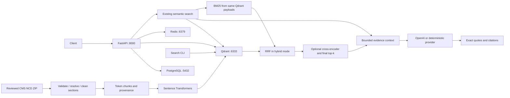

# CareFlow AI

An evidence-grounded healthcare operations intelligence platform, developed in
verified phases. The planned system combines public Medicare coverage policies
with synthetic claims and patient records to support documentation review.
It is an engineering portfolio project, not a clinical decision system.

**Current scope: Phase 9 — LangGraph router & structured tools.** Phase 8 added
an independent structured-data layer: CMS DE-SynPUF synthetic claims and
Synthea synthetic FHIR R4 patient records in PostgreSQL, behind a
parameterized-SQL-only repository layer (checksum-gated source validation,
per-record quarantine, provenance, idempotent loading). Phase 9 adds a small
real `langgraph.StateGraph` that routes a request to either the existing,
unchanged Phase 1-7 policy RAG pipeline or one of 18 Phase 8 structured tools
— deterministically by default, with no route (including policy) getting
unmatched free text as a fallback. See the
[Phase 8 guide](docs/phase8_structured_health_data.md) and
[Phase 9 guide](docs/phase9_langgraph_orchestration.md) for architecture,
real findings (multi-coding, `Observation.value[x]` diversity, claim
identity, two strict-validation bugs caught live), schema/graph, and
reproduction steps. `POST /orchestrate` is new; `POST /query`'s contract is
unchanged.

The Phase 7 retrieval evaluation below remains the last verified state of the
unstructured pipeline: a versioned 32-case development dataset measuring
retrieval, eligibility, abstention and latency separately over the same 39 CMS
chunks.

On 25 positive cases, Hit@1 was 22/25 for dense and 24/25 for BM25, hybrid and
reranked hybrid. All reached 25/25 at Hit@5. Reranking improved one case and
degraded one. All modes abstained on six of seven unanswerable cases, but attempted
an answer to an unsupported insulin-pump brand/dose question. Four positive cases
retrieved expected evidence below the unchanged 0.6 cosine gate. These are
small-corpus development observations, not production or clinical accuracy.
Generation checks use the deterministic provider, not a live LLM.

See the [dataset analysis](docs/cms_dataset_analysis.md),
[ingestion guide](docs/cms_ingestion.md), [basic RAG design](docs/cms_basic_rag.md),
[hybrid retrieval design](docs/cms_hybrid_retrieval.md), and
[Phase 6 model, windowing, evaluation and verification](docs/cms_cross_encoder_reranking.md).
See the [Phase 7 evaluation guide](docs/evaluation/README.md) and
[measured results and failures](docs/evaluation/retrieval_eval_v1.md).
Agents, authentication and the frontend remain later phases.

## Run locally

Requirements: Docker Desktop (or Docker Engine with Compose v2). For native Python
development, use Python 3.12. Run commands from the repository root.

```bash
# Fresh checkout only: preserve an existing .env and its local port settings.
cp -n .env.example .env
docker compose up --build -d --wait --wait-timeout 180
docker compose ps
curl --fail http://localhost:8000/health
```

Open [API documentation](http://localhost:8000/docs).
`GET /health` returns HTTP 200 only when PostgreSQL answers `SELECT 1`, Qdrant's
`/readyz` endpoint succeeds, and Redis answers `PING`. Otherwise it returns HTTP 503
with `status: degraded` and per-service availability. Probes run concurrently with
a configurable timeout and omit connection details from responses.

The backend container's health check includes all three dependencies, so Compose's
`--wait` also verifies Qdrant readiness. Qdrant's image does not need curl installed.
See [Qdrant monitoring](https://qdrant.tech/documentation/operations/monitoring/)
and [Compose startup ordering](https://docs.docker.com/compose/how-tos/startup-order/).

```bash
docker compose logs backend postgres qdrant redis
docker compose stop
docker compose start
```

`docker compose down` removes containers and preserves named data volumes. Avoid
`down -v` unless you intend to delete all local database and index data.

## Native backend development

```bash
python3.12 -m venv .venv
.venv/bin/python -m pip install -r requirements-dev.lock
.venv/bin/python -m pip install --no-deps -e .
docker compose up -d postgres qdrant redis --wait
.venv/bin/uvicorn app.main:app --reload --host 127.0.0.1 --port 8000
```

If the backend container is already running, stop it with `docker compose stop backend`
before starting native Uvicorn on port 8000. `.env` uses localhost addresses; Compose
sets internal service addresses for the backend automatically. If you change local
database credentials, update `DATABASE_URL` as well (URL-encode password characters).
PostgreSQL initialization settings apply only to an empty volume.

## Testing

```bash
.venv/bin/ruff check .
.venv/bin/ruff format --check .
.venv/bin/pytest -q
# With all four services running:
.venv/bin/python scripts/verify_services.py
CAREFLOW_INTEGRATION=1 .venv/bin/pytest -q
# After ingesting the reviewed snapshot and downloading both pinned models:
CAREFLOW_INTEGRATION=1 CAREFLOW_INGESTION_INTEGRATION=1 CAREFLOW_RAG_INTEGRATION=1 CAREFLOW_HYBRID_INTEGRATION=1 CAREFLOW_RERANK_INTEGRATION=1 .venv/bin/pytest -q
```

For this machine’s alternate API port, set `CAREFLOW_API_URL=http://localhost:18000`
before live pytest commands; fresh default-port setups can omit it.

Default tests cover source validation, cleaning, chunking, and isolated Qdrant
storage behavior, health/query APIs, provider contracts and citation validation. Source tests skip when the reviewed
raw archive is absent; network/model integration tests require the flags above.
Synthetic vectors test storage behavior only; semantic checks use the real model.
See [Phase 1 verification](docs/phase1_verification.md) for measured results and commands.

## Architecture

Implemented infrastructure, ingestion and basic RAG:



Planned: Next.js/TypeScript frontend → analysis → validation → cited report and
human review. Implemented retrieval supports dense, BM25, RRF hybrid search and
optional cross-encoder reranking. Phase 7 evaluation and Phase 8 structured
DE-SynPUF/FHIR ingestion are implemented as an independent layer. Phase 9 adds
a real `langgraph.StateGraph` router (`POST /orchestrate`) that dispatches
deterministically to policy retrieval or restricted structured-data tools —
see the [Phase 9 guide](docs/phase9_langgraph_orchestration.md). Multi-agent
behavior and the remaining roadmap are planned (Phase 10+).

## Repository

| Path | Purpose |
| --- | --- |
| `backend/app/` | FastAPI health/query APIs, settings, generation providers and evidence validation |
| `frontend/` | Reserved for Next.js in Phase 14 |
| `ingestion/` | CMS NCD ingestion, chunking, embeddings, Qdrant indexing and search; other sources reserved |
| `evaluation/` | Versioned development label validation, retrieval metrics, eligibility analysis and reports |
| `tests/` | API, source, chunking, storage, embeddings and live search tests |
| `data/raw/` | Ignored raw dataset directories |
| `data/processed/` | Ignored processed outputs |
| `infrastructure/` | Reserved for later infrastructure configuration |
| `scripts/` | Live dependency verification and CMS dataset inspection |
| `docs/` | Development and verification notes |
| `.github/workflows/` | Reserved for CI in Phase 16 |

## Datasets and privacy

**Never use real PHI.** Only public policy documents, synthetic claims, and synthetic
patient records are permitted. Phase 2 inspected public CMS NCD policies and the
official NCD/LCD/Article dictionaries; no claims or patient records were downloaded.
The software license does not replace upstream dataset terms.

| Planned source | Local raw directory | Inspection phase |
| --- | --- | --- |
| [CMS Medicare Coverage Database](https://www.cms.gov/medicare-coverage-database/downloads/downloadable-databases.aspx) | `data/raw/cms_coverage/` | 2 |
| [CMS DE-SynPUF](https://www.cms.gov/data-research/statistics-trends-and-reports/medicare-claims-synthetic-public-use-files) | `data/raw/cms_synpuf/` | 8 |
| [Synthea](https://synthetichealth.github.io/synthea/) | `data/raw/synthea/` | 8 |

The inspected NCD snapshot is data as of August 30, 2026, released September 3,
2026. Its four CSV tables contain 357 policy records and related reference data.
The implemented ingestion selects eight exact ID/version pairs. Raw data stays
ignored by Git. [Download and inspection instructions](docs/cms_dataset_analysis.md#8-reproduce-the-inspection)
include the archive checksum; CMS may replace the file at the same URL.

```bash
.venv/bin/python scripts/inspect_cms_ncd.py --check docs/cms_inspection/ncd_profile.json
```

This profiles raw CSVs and validates saved findings; it does not ingest policies.
LCD and Article **data exports** still
require inspection before implementing their adapters. DE-SynPUF and Synthea
inspection and ingestion are implemented — see the
[Phase 8 guide](docs/phase8_structured_health_data.md). MIMIC-IV is a potential
future extension only.

## Ingest and search

With the development dependencies installed and the exact Phase 2 archive in
`data/raw/cms_coverage/ncd.zip`:

```bash
docker compose up -d qdrant
.venv/bin/python -m ingestion.cli ingest
.venv/bin/python -m ingestion.cli search --offline \
  "What must a physician prescription document to justify a hospital bed?"
.venv/bin/python -m ingestion.cli search --offline --document-id 226 --version 3 \
  --source-field indctn_lmtn "CPAP sleep testing documentation"
.venv/bin/python scripts/verify_ncd_search.py --output /tmp/careflow-search-results.json
```

The first ingestion downloads a pinned MiniLM revision; later runs can use
`--offline`. The CLI runs in the native Python environment and uses the Compose
Qdrant service. The API image includes CPU embedding dependencies and mounts
`.cache/models` read-only. Run ingestion before using `/query`.
No LLM key is required and the search command returns evidence, not generated answers.

I use a 700-token chunk target with 120-token overlap. MiniLM accepts 256 input
tokens, so the embedding provider processes longer chunks in bounded windows and
combines their vectors instead of silently truncating evidence. Search uses the
`careflow_cms_ncd` alias, 384-dimensional vectors, and cosine similarity.

Repeated ingestion preserves IDs and point count. `ingest --offline --reindex`
builds and checks a new generation before switching the alias; old collections
remain available. Details, limitations, source requirements and actual search
results are in the [ingestion guide](docs/cms_ingestion.md).

## Compare retrieval modes

```bash
.venv/bin/python -m ingestion.cli search --offline --mode dense "C-peptide testing for insulin pumps"
.venv/bin/python -m ingestion.cli search --mode bm25 "C-peptide testing for insulin pumps"
.venv/bin/python -m ingestion.cli search --offline --mode hybrid "C-peptide testing for insulin pumps"
.venv/bin/python scripts/compare_retrieval.py --output /tmp/phase5-comparison.json
```

BM25 search needs no embedding model. Hybrid uses 10 candidates per branch and RRF
constant 60 by default. RAG preserves the existing cosine evidence check in all
modes; even BM25 RAG therefore needs the embedding model. Raw BM25 and RRF scores
are never treated as confidence. The [Phase 5 guide](docs/cms_hybrid_retrieval.md)
explains this conservative tradeoff and records the actual rankings and timings.

## Optional cross-encoder reranking

The model is `cross-encoder/ms-marco-MiniLM-L6-v2`, pinned to revision
`233902d25c440f23af6f7d6e94d2946bac0bee0a`. Overlapping windows cover long
chunks without tail truncation; the maximum window logit determines ordering.
A relevance score does not replace the existing cosine evidence gate.

```bash
# Download the pinned cross-encoder once; the cache remains ignored by Git.
HF_HUB_DISABLE_XET=1 .venv/bin/python -c 'from app.reranking.cross_encoder import MiniLMCrossEncoder; print(MiniLMCrossEncoder(offline=False).describe())'
.venv/bin/python -m ingestion.cli search --offline --mode hybrid --rerank \
  --rerank-candidates 10 --top-k 5 "What specialty evaluation is required for power wheelchair seat elevation equipment?"
.venv/bin/python scripts/compare_reranking.py --output /tmp/phase6-comparison.json
RETRIEVAL_MODE=hybrid RERANK_ENABLED=true docker compose up -d --no-deps --wait backend
```

`RERANK_CANDIDATE_K=10` controls the pool, and existing `RAG_TOP_K=5` controls
final RAG evidence count. `RERANK_OFFLINE=true` requires cached weights; Docker
uses the existing read-only model mount. Missing weights or inference failures
produce a clear 503 error, with no silent fallback. Queries above 128 model
tokens produce 422 when reranking is enabled. Run `docker compose up -d
--no-deps --wait backend` to restore `.env`/default settings after experiments.
See the [Phase 6 report](docs/cms_cross_encoder_reranking.md) for measured CPU
latency, all four retrieval comparisons and limitations.

## Ask a policy question

After Phase 3 ingestion has populated Qdrant and the model cache:

```bash
.venv/bin/python -m ingestion.cli rag --offline \
  "What must a physician prescription document to justify a hospital bed?"
curl --fail http://localhost:8000/query -H 'Content-Type: application/json' \
  -d '{"question":"What must a physician prescription document to justify a hospital bed?"}'
```

`--mode dense|bm25|hybrid` selects retrieval for CLI RAG. Set `RETRIEVAL_MODE`
for the API and recreate the backend container. `RAG_PROVIDER=deterministic` is the
default offline test double; it quotes the first
eligible evidence chunk. Set `RAG_PROVIDER=openai`, `RAG_MODEL` and `OPENAI_API_KEY`
to use a real model. Responses include answer, exact NCD/version/section/chunk
citations, retrieved IDs, provider identity, prompt version and abstention status.
No confidence score is invented. Read the [Phase 4 limitations](docs/cms_basic_rag.md)
before interpreting excerpts as complete policy answers.

If other projects occupy the default ports, use `BACKEND_PORT`, `QDRANT_PORT`,
`REDIS_PORT` and matching native URLs in `.env`. This machine's Phase 4 verification
uses API **18000**, Qdrant **16333**, Redis **16379**, PostgreSQL **55432**.
Open [verified local API docs](http://localhost:18000/docs).

## Configuration and security

See `.env.example` for environment variables. `.env`, raw data, and build artifacts
are ignored by Git. Runtime Python dependencies and container image versions are pinned;
lock files pin the resolved Python environment. The backend runs as a non-root user.
All published ports bind to loopback. The bundled password is for local development.
JWT, RBAC, rate limiting, TLS, and production secret management are not implemented yet;
do not expose this scaffold publicly. No LLM/API keys are needed for Phase 1.

## Roadmap and limitations

The approved sequence is: (1) scaffold, (2) CMS inspection, (3) ingestion,
(4) basic RAG, (5) hybrid retrieval, (6) reranking, (7) retrieval evaluation,
(8) structured datasets, (9) router/tools, (10) full agent workflow,
(11) review/audit, (12) evaluation/experiments, (13) caching/reliability,
(14) frontend, (15) dashboard, (16) tests/CI, (17) GitHub polish.
Every phase requires working verification and user approval before proceeding.

Future AWS mapping: S3 for documents, RDS PostgreSQL, ElastiCache Redis,
ECS/Fargate for the API, ECR images, Secrets Manager, and CloudWatch. Qdrant hosting
will be selected separately. No cloud resources or GitHub repository have been created.
Evaluation tables, regression baselines, screenshots, and deployment claims will be
added only when their corresponding features are implemented and measured.

## License

[MIT](LICENSE).

## Reproduce the Phase 7 development evaluation

With the existing model cache and canonical Qdrant index available:

```bash
.venv/bin/python -m pip install --no-deps --no-build-isolation -e .
.venv/bin/python -m evaluation.run_retrieval_eval
```

This validates all labels against the corpus, evaluates four modes three times
per query, and writes JSON and Markdown reports under `docs/evaluation/`.
See the [evaluation guide](docs/evaluation/README.md) for label provenance,
MRR@5 and abstention definitions, timing boundaries and limitations.
