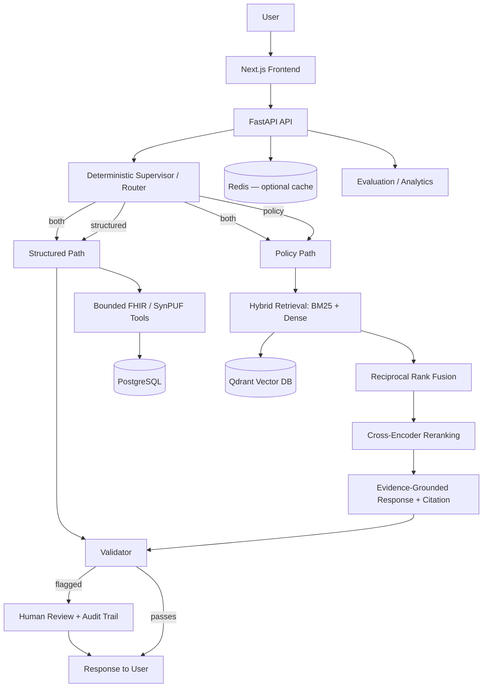

# CareFlow AI

Evidence-grounded healthcare intelligence platform that routes Medicare policy
questions and synthetic patient/claims lookups through a bounded, auditable
multi-agent pipeline — with hybrid retrieval, cross-encoder reranking, human
review, and a measured evaluation suite behind every answer.

[](https://github.com/churnika67/careflow-ai/actions/workflows/ci.yml)


## Live Demo

**[careflow-ai-beryl.vercel.app](https://careflow-ai-beryl.vercel.app)**

Frontend is on Vercel; the FastAPI backend runs on Render's free tier, which
spins down after periods of inactivity. If the app has been idle, the first
request can take up to a minute while it wakes back up — after that it
responds normally.

## What I Built

I built CareFlow AI as an evidence-grounded healthcare intelligence platform
that combines Medicare coverage policy retrieval with structured synthetic
FHIR and claims data behind one interface. A user asks a healthcare
operations question in plain language; a deterministic router classifies it
and dispatches to the right evidence source — Medicare policy retrieval,
bounded FHIR/claims lookup tools, or both together — and every response
carries its evidence with it: a real citation for policy answers, a real
tool result for structured lookups, and a validation result confirming the
two stayed properly separated when combined.

The platform includes a full human-in-the-loop review workflow with an audit
trail, a reproducible retrieval evaluation suite, a live analytics
dashboard, 1,171 automated tests, a six-job CI pipeline on every commit, and
a real deployed instance — not just a local demo.

## Why CareFlow

Healthcare operations questions rarely have one clean answer source. Policy
questions live in dense regulatory documents; patient and claims context
lives in structured records; and a general-purpose LLM asked to reason over
both at once has no way to prove which parts of its answer are actually
grounded in evidence versus generated from its own priors.

CareFlow addresses this with a narrower, more verifiable design: a
deterministic router (not a free-form agent) decides which bounded path a
request takes, retrieval is hybrid and reranked rather than single-shot,
every policy answer is checked against its retrieved evidence before being
returned, structured lookups run through a fixed tool registry instead of
generated queries, and anything the system can't ground confidently
abstains instead of guessing. Results that fail validation, or that a
reviewer flags, go through an explicit human review step with a full audit
trail. This is not a claim that CareFlow makes better clinical decisions —
it's an engineering approach to making an evidence-grounded system's
behavior legible and testable.

## Key Capabilities

- **Evidence-grounded Medicare policy RAG** — hybrid dense + BM25 retrieval
  with reciprocal rank fusion, optional cross-encoder reranking, and
  citations validated against the retrieved evidence before an answer is
  returned
- **Structured healthcare data tools** — a fixed registry of bounded lookup
  tools over synthetic Synthea FHIR R4 records and CMS DE-SynPUF synthetic
  claims (patient/beneficiary summaries, encounters, conditions,
  procedures, observations, medications, claims, population-level
  aggregates) — never arbitrary/generated SQL
- **Deterministic routing** — a `langgraph.StateGraph` classifies each
  request to a policy, structured, or combined path; nothing is decided by
  free-form agent reasoning
- **Bounded multi-agent orchestration** — the combined workflow runs policy
  and structured retrieval together, keeps the two evidence sources
  visually and semantically separate, and validates the result — it never
  implies a policy applies to a specific synthetic patient
- **Abstention over guessing** — unsupported, out-of-scope, or
  insufficient-evidence requests abstain with an explicit reason instead of
  producing an unfounded answer
- **Human-in-the-loop review** — validation failures and explicitly
  requested reviews enter a queue with a full evidence snapshot, decision
  (approve/reject/request revision), and audit history
- **Reproducible evaluation suite** — a versioned development set and a
  separate project-authored held-out set measure retrieval quality,
  reranker impact, threshold behavior, latency, and citation-to-evidence
  match against frozen datasets
- **Live analytics dashboard** — the deployed evaluation snapshot and
  population-level FHIR/SynPUF aggregates, read from persisted artifacts,
  never recomputed on the fly
- **Optional Redis-backed caching** — treated as a non-authoritative
  performance dependency; a Redis outage never affects readiness
- **1,171 automated tests, 9 end-to-end browser journeys, and a six-job
  GitHub Actions pipeline** gating every commit
- **Deployed to production** — Vercel + Render + Neon + Qdrant Cloud, not
  just a local Docker Compose demo

## Architecture



Supporting infrastructure: **Qdrant** for vector search, **PostgreSQL** for
structured data and review/audit state, **Redis** as an optional,
non-authoritative performance cache, and a versioned **evaluation/analytics**
layer read by the live dashboard.

### How a request flows

1. A user asks a healthcare operations question through the frontend.
2. The router classifies the request as policy, structured, or combined.
3. Policy requests run hybrid retrieval (BM25 + dense, fused with RRF),
   optionally reranked, and the answer is checked against its citations.
4. Structured requests run through a fixed tool registry against
   PostgreSQL — never a generated or arbitrary query.
5. Combined requests run both paths and keep the two evidence sources
   separate; the response never implies policy applies to the specific
   synthetic patient.
6. A validator checks the result's internal consistency.
7. Unsupported or insufficient-evidence requests abstain with a reason.
8. Results that fail validation — or that a user explicitly flags — enter
   the human review queue with a full audit trail.

## Tech Stack

**Frontend** — Next.js 16, React 19, TypeScript, CSS Modules

**Backend** — Python 3.12, FastAPI, LangGraph (deterministic state-graph
orchestration), Pydantic

**Retrieval / ML** — Sentence Transformers (`all-MiniLM-L6-v2`), BM25,
Qdrant, cross-encoder reranking (`ms-marco-MiniLM-L6-v2`), PyTorch (CPU
inference)

**Data** — PostgreSQL, public CMS Medicare Coverage Database policy
documents, Synthea synthetic FHIR R4 patient records, CMS DE-SynPUF
synthetic/sample claims

**Infrastructure** — Docker Compose (local), Vercel (frontend), Render
(backend), Neon (PostgreSQL), Qdrant Cloud (vector search), Redis (optional,
local/self-configured)

**Testing / CI** — Pytest, Vitest + React Testing Library, Playwright,
GitHub Actions (six-job pipeline on every push/PR)

## Evaluation

Retrieval quality is measured on two separate sets, never combined or
averaged into one score:

| | Cases | Positive | Negative |
|---|---:|---:|---:|
| Development/regression set | 32 | 25 | 7 |
| Held-out set (project-authored) | 12 | 10 | 2 |

The held-out set is **project-authored and category-stratified, not an
independent external benchmark and not clinician-validated** — it's a
second, disjoint sample used to check that the development set's results
generalize at all, not a claim of production-grade accuracy.

**Development set, hybrid retrieval:** Hit@1 0.96 (24/25), Hit@3/Hit@5 1.00,
MRR@5 0.98. **Held-out set, hybrid retrieval:** Hit@1 0.70 (7/10), MRR@5
0.78; with cross-encoder reranking, MRR@5 improves to 0.83 and Hit@3/Hit@5
reach 1.00 — the reranker helps most on the smaller, harder held-out sample.

That improvement isn't free: reranking adds roughly 425ms of median latency
per query on top of ~27ms for hybrid retrieval alone (measured on the
development corpus) — a real accuracy/latency tradeoff, not a strictly
better option.

Citation quality is measured as **expected-evidence match** (does the cited
chunk match the pre-labeled expected evidence for that query) — this is not
a claim of factual correctness or entailment. The full methodology,
per-query results, and known limitations (small corpus, non-independent
held-out set, no clinician review) are documented in
[`docs/evaluation/`](docs/evaluation/) and surfaced live on the deployed
[Analytics page](https://careflow-ai-beryl.vercel.app/analytics).

## Safety & Healthcare Boundaries

- **No real PHI, anywhere.** Only public CMS policy documents, synthetic
  Synthea FHIR records, and synthetic/sample CMS DE-SynPUF claims are used.
- **No identity linkage between datasets** — FHIR and SynPUF are two
  independent synthetic populations, never joined or cross-referenced.
- **No arbitrary or generated SQL** — structured lookups run through a
  fixed, reviewed tool registry only.
- **No patient-specific coverage or medical-necessity inference** — the
  combined policy+structured workflow keeps both evidence sources visually
  and semantically separate and never implies a policy determination for a
  specific synthetic patient.
- **Abstention is a first-class outcome** — unsupported or
  insufficient-evidence requests return an explicit abstention reason
  instead of a guess.
- **Human review means workflow acceptance, not clinical correctness.** An
  "approved" review result means a reviewer accepted the system's output
  for the application workflow — it is never a coverage, eligibility, or
  medical-necessity decision, and reviewer identity is a caller-supplied
  string, not an authenticated identity.

## Production Deployment

| Component | Provider |
|---|---|
| Frontend | [Vercel](https://vercel.com) |
| Backend API | [Render](https://render.com) |
| PostgreSQL | [Neon](https://neon.com) |
| Vector search | [Qdrant Cloud](https://qdrant.tech) |
| Cache | Redis — optional, not currently configured in production |

**Live frontend:** <https://careflow-ai-beryl.vercel.app>

The backend runs the same Docker image as local development, with the
embedding model baked in at build time (no host-mounted cache in
production). CI runs the full test suite, the six-job pipeline, and a
9-scenario Playwright E2E suite against a completely isolated,
freshly-bootstrapped environment on every push — the same clean-bootstrap
mechanism used to prove the production deployment reproducible from a
fresh checkout.

## Testing

```text
Backend:      841 passed, 170 skipped (unit tier; skips are gated
              integration/live-model tests, not failures)
Frontend:     330 passed
End-to-end:   9 Playwright browser journeys (smoke, policy, FHIR, SynPUF,
              analytics, combined workflow, HITL review lifecycle,
              dependency-degradation/recovery, abstention)
CI pipeline:  6 jobs on every push/PR — backend quality, frontend quality,
              backend unit tests, frontend unit tests, a deterministic
              integration subset, and the full E2E suite
```

No job requires an OpenAI key or any other secret — the deterministic
generation provider used throughout requires no external API access.

```bash
# Backend
.venv/bin/pytest tests/ -q
.venv/bin/ruff check . && .venv/bin/ruff format --check .

# Frontend
cd frontend && npm test && npm run lint && npm run typecheck

# End-to-end (against a running stack)
cd frontend && npx playwright install chromium && npm run test:e2e
```

## Repository Structure

```text
backend/app/           FastAPI app: routing, orchestration, retrieval,
                       generation, review/audit, health, analytics
ingestion/             CMS policy ingestion, chunking, embeddings, indexing;
                       Synthea FHIR and DE-SynPUF structured ingestion
frontend/              Next.js/TypeScript app + Playwright E2E suite
evaluation/            Retrieval/reranker/threshold evaluation pipeline
artifacts/evaluation/  Persisted, versioned evaluation run artifacts
tests/                 Backend test suite (unit + gated integration tiers)
docs/                  Design records, evaluation methodology, dataset notes
scripts/               Clean-environment bootstrap, service verification,
                       dataset inspection utilities
.github/workflows/     CI pipeline (ci.yml)
```

## Local Development

Requirements: Docker Desktop (or Docker Engine + Compose v2); Python 3.12
for native backend development; Node 20+ for the frontend.

```bash
cp -n .env.example .env
docker compose up --build -d --wait --wait-timeout 180
curl --fail http://localhost:8000/ready
```

Native backend development:

```bash
python3.12 -m venv .venv
.venv/bin/python -m pip install -r requirements-dev.lock
.venv/bin/python -m pip install --no-deps -e .
docker compose up -d postgres qdrant redis --wait
.venv/bin/uvicorn app.main:app --reload --host 127.0.0.1 --port 8000
```

Frontend:

```bash
cd frontend
npm install
cp .env.example .env.local   # point NEXT_PUBLIC_API_BASE_URL at your backend
npm run dev
```

The CMS policy corpus, Synthea FHIR sample, and DE-SynPUF sample are large
raw source files and are not committed to the repository. Ingestion is
idempotent and reuses the project's own commands — see
[`docs/cms_ingestion.md`](docs/cms_ingestion.md) and
[`scripts/bootstrap_clean_e2e_env.sh`](scripts/bootstrap_clean_e2e_env.sh)
for the exact download-and-ingest sequence, including a fully isolated
variant that never touches your own local database.

## API Examples

Against the live production backend:

```bash
curl https://careflow-ai-ppra.onrender.com/ready
```

```json
{
  "status": "ready",
  "dependencies": {
    "postgresql": {"status": "ok"},
    "qdrant": {"status": "ok"},
    "redis": {"status": "unavailable"}
  }
}
```

Redis is optional and non-authoritative — `status` stays `"ready"`
regardless of its availability; only PostgreSQL and Qdrant gate readiness
(`backend/app/services/health.py`).

```bash
curl -s -X POST https://careflow-ai-ppra.onrender.com/query \
  -H 'Content-Type: application/json' \
  -d '{"question":"Does Medicare cover hospital beds?"}'
```

Against a local instance, replace the host with `http://localhost:8000` (see
[Local Development](#local-development)).

## Author

**Marappa Reddy Churnika**

M.S. Engineering Science – Data Science
University at Buffalo

GitHub: [github.com/churnika67](https://github.com/churnika67)
Portfolio: [churnika67.github.io](https://churnika67.github.io)
LinkedIn: [linkedin.com/in/churnika](https://www.linkedin.com/in/churnika)

## License

[MIT](LICENSE)
