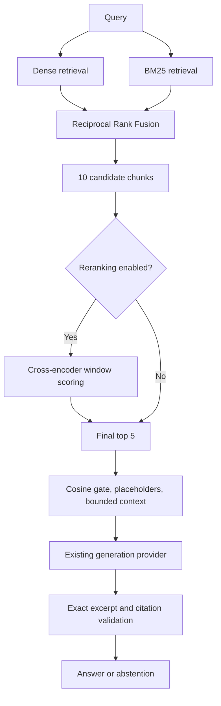

# Phase 6 — Cross-encoder reranking

## Scope and interrupted-work audit

Phase 6 adds optional reranking to the existing retrieval and RAG paths. It does
not rebuild embeddings, change the CMS corpus, or implement Phase 7.

The audit ran `git status --short`, `git diff`, `git diff --stat`, `git ls-files`
and `git log -1 --oneline` before further edits. This repository has no commits
or tracked files: Git cannot establish a Phase 5 baseline or isolate a Phase 6
diff. The file inventory below comes from inspecting the interrupted work and
its recorded history; it is not a reconstructed Git diff.

The partial implementation already had the pinned CPU model, overlapping windows,
optional runtime/CLI wiring, Compose settings, initial tests and a preliminary
hybrid-only comparison. These were retained. The resumed work adds the four-mode
comparison, structured CLI errors, concise ranking logs, output validation,
additional contract tests, Docker verification and documentation. Existing
Phase 1–5 tests were retained. Initial live checks timed out while Docker Desktop
was manually paused; those failures were not treated as code regressions.

## Architecture and responsibilities



Dense search compares independent query/document embeddings. BM25 matches terms.
Hybrid combines their ranks using RRF. The cross-encoder jointly reads the query
and each retrieved candidate to reorder that candidate pool. It cannot recover
an item absent from that pool.

`Reranker` is a scoring protocol; `rerank()` handles ordering, validation and
result metadata independently of the model. `MiniLMCrossEncoder` implements the
protocol. Runtime composition and the CLI choose whether to apply it. The FastAPI
route, response schema, context builder and generator are unchanged. Dense and
BM25 candidates can also be reranked for experiments.

## Model and bounded windows

The model is [cross-encoder/ms-marco-MiniLM-L6-v2](https://huggingface.co/cross-encoder/ms-marco-MiniLM-L6-v2/tree/233902d25c440f23af6f7d6e94d2946bac0bee0a),
revision `233902d25c440f23af6f7d6e94d2946bac0bee0a`. It uses the existing pinned
sentence-transformers 5.1.0, transformers 4.55.4 and torch 2.8.0 dependencies.
No dependency or ML framework was added. Loading requires safetensors and disables
remote code. Inference uses CPU, two Torch threads, evaluation mode and batches
of at most eight pairs. The actual package identity is saved with the evaluation.

Each pair contains the query and `title + "\n" + section + "\n" + text`.
The reviewed ingestion chunks target 700 embedding-tokenizer tokens, which can
exceed this model's 512-token pair limit. The cross-encoder tokenizes its own input
without truncation. Queries must contain 1–128 tokens. Evidence window capacity
is `512 - query_tokens - pair_special_tokens` (three for this tokenizer); at the
maximum query size, 381 evidence tokens fit. Adjacent windows overlap by 64 tokens
and cover the entire input, including the tail. The query is repeated in every
pair. Title and section occur at the beginning of the combined evidence, rather
than being prepended again to every window.

The chunk score is the **maximum raw window logit**. A relevant passage can thus
rank a long section highly. Equal window scores select the earliest window;
equal chunk scores sort by chunk UUID. Window offsets are half-open token ranges
in the combined title/section/text input, not page numbers or raw-source offsets.
Short-pair output is tested against native `CrossEncoder.predict` with identity
activation; explicit pair construction prevents silent truncation on long inputs.

## Configuration and failures

| Setting | Default | Purpose |
| --- | --- | --- |
| `RERANK_ENABLED` | `false` | Preserve the existing default path; enable explicitly |
| `RETRIEVAL_MODE` | `dense` | Set to `hybrid` for the Phase 6 path |
| `RERANK_CANDIDATE_K` | `10` | Candidate pool, validated 1–20 |
| `RAG_TOP_K` | `5` | Existing final RAG result count, validated 1–20 |
| `RERANK_MODEL_CACHE` | `.cache/models` | Native model cache; `/models` in Docker |
| `RERANK_OFFLINE` | `true` | Require the pinned revision in cache |

The CLI exposes `--rerank` / `--no-rerank`, `--rerank-candidates` and `--top-k`.
The actual depth is `max(final_top_k, rerank_candidate_k)`. Ten candidates and
five final hits give reranking room to change membership without scoring all 39
chunks. The model/revision have one pinned definition in the provider, rather
than a runtime model selector that could silently change behavior. The existing
`RAG_TOP_K` avoids a second conflicting final-size setting.

An empty candidate list skips model loading. Duplicate IDs and invalid output
counts, scores or window traces fail explicitly. Model loading/inference failure
returns API HTTP 503 with `reranking_unavailable`; no silent fallback occurs.
An overlong tokenized query returns HTTP 422 with `rerank_query_too_long`. The
search CLI emits the corresponding JSON error to stderr and exits nonzero.
Disabling reranking avoids loading the model and uses the prior retrieval depth.
The API's existing inference lock serializes shared tokenizer/model access.

The internal INFO event `reranking_complete` records retrieval modes, candidate
count, enabled state, model, reranking latency and final chunk IDs. It does not
log the question or full evidence. Search CLI JSON exposes ranking diagnostics;
the public RAG response retains its existing contract.

## Evidence safeguards and preserved fields

Results retain every original payload field, including chunk/document/version
IDs, section, source URL, dates, text, original `score`, dense/BM25 scores and
ranks, fusion score/rank, and `evidence_gate_score`. New fields are
`candidate_rank`, `rerank_score`, `rerank_rank`, `reranker`,
`rerank_window_count`, `rerank_window_token_start` and `rerank_window_token_end`.
No result is changed in Qdrant.

A rerank score is a relevance logit, **not confidence, probability or medical
certainty**. Existing RAG still requires cosine similarity of at least 0.6.
Hybrid/BM25 RAG uses the existing dense top-20 evidence-gate lookup; missing
cosine evidence is ineligible. Neither RRF nor cross-encoder scores can override
that gate. Context remains bounded to 24,000 characters, excludes N/A and other
non-substantive placeholders, and retains whole eligible chunks. Citation IDs
must belong to the actual context and excerpts must match source paragraphs.
The cross-encoder selects order; the original full chunk remains the evidence.

Existing retrieval metadata/version filters run before reranking. Dates remain
metadata. The audited implementation has **no temporal query filter**: Phase 6
neither adds one nor claims one exists. There are no fabricated page numbers.

## Reproduce

Commands run from the repository root with Python 3.12 and the reviewed index.
The local `.env` on this machine uses API 18000 and Qdrant 16333 because another
project uses the default ports. Preserve existing `.env` values.

```bash
# First download only; subsequent runs are offline.
HF_HUB_DISABLE_XET=1 .venv/bin/python -c 'from app.reranking.cross_encoder import MiniLMCrossEncoder; print(MiniLMCrossEncoder(offline=False).describe())'
.venv/bin/python -m ingestion.cli search --offline --mode hybrid --rerank \
  --rerank-candidates 10 --top-k 5 'What specialty evaluation is required for power wheelchair seat elevation equipment?'
.venv/bin/python -m ingestion.cli rag --offline --mode hybrid --rerank \
  'What must a physician prescription document to justify a hospital bed?'
.venv/bin/python scripts/compare_reranking.py --output /tmp/phase6-comparison.json
docker compose up --build -d --wait --wait-timeout 180
RETRIEVAL_MODE=hybrid RERANK_ENABLED=true docker compose up -d --no-deps --wait backend
curl --fail http://localhost:18000/health
curl --fail http://localhost:18000/query -H 'Content-Type: application/json' \
  -d '{"question":"What specialty evaluation is required for power wheelchair seat elevation equipment?"}'
# Restore .env/default settings after the enabled-path check.
docker compose up -d --no-deps --wait backend
.venv/bin/ruff check .
.venv/bin/ruff format --check .
.venv/bin/pytest -q tests/test_reranking.py
CAREFLOW_API_URL=http://localhost:18000 CAREFLOW_INTEGRATION=1 CAREFLOW_INGESTION_INTEGRATION=1 CAREFLOW_RAG_INTEGRATION=1 CAREFLOW_HYBRID_INTEGRATION=1 CAREFLOW_RERANK_INTEGRATION=1 .venv/bin/pytest -q
```

## Evaluation method

The same eight Phase 5 development questions and three negative questions are
used without expansion or query-specific boosts. A hit requires the expected
NCD ID, version, source section and evidence phrase, not merely the correct
policy title. The comparison records all four modes and before/after top-five
rankings for every query. It asserts deterministic repeated output and an
unchanged physical collection/corpus. Each mode is warmed, then timed three
times per question (33 calls). Rerank-only latency excludes retrieval, model
loading and generation. These are local development timings, not throughput or
production accuracy estimates. Generation uses the deterministic provider;
no live LLM quality result is claimed.

## Known limitations and interview points

The corpus is only eight selected NCD versions and 39 chunks; the eight positive
questions were used during development. Perfect results on these cases do not
establish generalization. MS MARCO is not a Medicare-specialized model. Maximum
window aggregation can favor longer chunks with more opportunities for a high
score. The selected window does not replace the full chunk in bounded context.
The fixed cosine gate can reject relevant lexical matches and cannot establish
coverage eligibility. CPU inference adds latency, is serialized in the API, and
has no separate inference deadline or result cache. A 128-token query limit
trades input flexibility for bounded pair capacity. Metadata dates alone do not
provide as-of-date reasoning.

For an interview, explain the distinct jobs: retrieval supplies recall, RRF merges
rankings without equating incompatible scores, and the cross-encoder spends more
compute to improve ordering. Explain why candidates outnumber final results,
why windowing prevents lost tail evidence, why a relevance logit cannot authorize
an answer, and why reproducible development observations are not a benchmark.
Agents, expanded golden evaluation, claims/FHIR ingestion, caching changes,
frontend and deployment remain planned later phases.

## Validation and changed files

Actual checks on September 22, 2026:

- Targeted reranker tests: 19 passed.
- Default suite: 129 passed, 30 skipped. Integration flags are opt-in.
- Full suite with all five integration flags and API port 18000: 159 passed,
  including all 132 existing Phase 1–5 tests and 27 Phase 6 tests.
- Two warnings: an upstream AnyIO alias deprecation and the existing local
  Qdrant test warning that payload indexes have no effect in local mode.
- Native dependency check: no broken requirements. Reviewed CMS archive/profile
  validation passed, including keys, joins, dates and exact subset.
- Docker image rebuilt successfully and Compose reported the backend healthy.

Before Docker was resumed, live checks failed on Qdrant timeouts and were
interrupted. They were rerun successfully once the existing services resumed.
A subsequent manual API assertion incorrectly expected the mobility policy to
be cited after reranking; the observed cosine gate excludes that chunk. This
is recorded as a limitation below, not removed from the findings or corrected
by lowering the threshold.

| File | Phase 6 work |
| --- | --- |
| `backend/app/core/config.py` | Optional reranking settings |
| `backend/app/generation/runtime.py` | Cached provider, candidate depth, explicit errors |
| `backend/app/reranking/__init__.py` | Package marker |
| `backend/app/reranking/cross_encoder.py` | Pinned CPU provider and window scoring |
| `backend/app/reranking/service.py` | Reusable ordering, preserved payload and logs |
| `ingestion/cli.py` | Search/RAG switches and clear model failures |
| `docker-compose.yml` | Four reranking environment settings, existing model mount |
| `.env.example` | Documented optional configuration |
| `tests/test_reranking.py` | 19 isolated contract tests |
| `tests/test_reranking_live.py` | Eight actual-model/corpus checks |
| `scripts/compare_reranking.py` | Four-mode evaluation and before/after evidence |
| `docs/phase6_reranking_comparison.json` | Actual rankings, timings and RAG observations |
| `docs/phase6_api_verification.json` | Enabled/disabled Docker API observations |
| `docs/cms_cross_encoder_reranking.md` | Design, audit, results and reproduction |
| `docs/phase6_pr_description.md` | Reviewable PR description and Git handoff |
| `README.md` | Current implementation, architecture and commands |

No dependency locks, ingestion transformations, source data, indexed chunks,
Phase 1–5 tests or generation/citation contracts were changed for Phase 6.
Model weights and raw data remain ignored. No commit, push, merge or PR was made.

Docker API verification used the actual pinned CPU model through the existing
read-only cache. Hospital-bed, seat-elevation and noncoverage citations passed;
all three negative questions abstained. An overlong query returned 422 with
`rerank_query_too_long`. The disabled and restored hospital-bed responses exactly
matched the saved Phase 4 response. Final defaults are dense retrieval with
reranking disabled. API, PostgreSQL, Qdrant and Redis health checks passed; both
native and container dependency checks found no broken requirements. Ruff lint
and format checks passed (53 Python files). `git diff --check` passed but has no
tracked diff to inspect; `git check-ignore` confirmed secrets/cache/raw data are
ignored.

Additional commands actually executed during the audit and verification included
`git status --short`, `git diff --stat`, `git ls-files`, `git log -1 --oneline`,
`docker compose ps`, `docker desktop --help`, `docker desktop start --timeout 30`,
`.venv/bin/python -m pip check`, `docker compose exec -T backend python -m pip check`,
`.venv/bin/python scripts/verify_services.py`, and the source-profile check in the
README. A temporary `/tmp/careflow_phase6_api.py` harness toggled Compose settings,
asserted HTTP responses with httpx, read model identity inside the container and
restored defaults in a `finally` block. Its actual observations are preserved in
`phase6_api_verification.json`. The timing evaluation was repeated after the Docker
build and full tests completed to avoid their CPU contention.

## Actual development results

The final measurement was recorded at 2026-09-22T15:40:16.009834+00:00.
All 39 chunks and the physical collection remained unchanged:
`careflow_cms_ncd__5ce29cd4691dc56423f2__279ea98f`.
The sorted corpus fingerprint was `1e55c381f68f3e0fe021b217a49ad05d246e87943a7f33cc5780e3e1bf31bcc2`.
The exact source remains the reviewed CMS NCD ZIP recorded in Phase 2; no source
records were added or changed.

| Mode | Hit@1 | Hit@3 | Hit@5 | Median warm latency |
| --- | --- | --- | --- | --- |
| dense | 6/8 | 7/8 | 8/8 | 15.3 ms retrieval |
| bm25 | 8/8 | 8/8 | 8/8 | 14.2 ms retrieval |
| hybrid | 7/8 | 8/8 | 8/8 | 28.5 ms retrieval |
| Hybrid + reranker | 8/8 | 8/8 | 8/8 | 449.3 ms reranking only |

The reranker scored 10 candidates and returned five. Its 33 warm CPU calls ranged
from 331.0 to 640.4 ms. Cached model construction was
20.1 ms after the embedding provider had initialized the ML runtime;
this is not cold process startup or download time. Retrieval timings use top five;
the reranking path retrieves ten with the RAG gate lookup. Their medians must not
be added and reported as a measured end-to-end latency.

Expected-evidence rank for each positive question:

| NCD / question | Dense | BM25 | Hybrid | Hybrid + reranker |
| --- | --- | --- | --- | --- |
| 169: What clinical testing must support an initial claim for oxygen therapy at home? | 1 | 1 | 1 | 1 |
| 226: What diagnosis and sleep test documentation supports an initial 12-week CPAP trial? | 1 | 1 | 1 | 1 |
| 219: How are mobility limitations in activities of daily living at home assessed for a wheelchair? | 5 | 1 | 2 | 1 |
| 223: What fasting C-peptide and glucose testing is required for an insulin infusion pump? | 1 | 1 | 1 | 1 |
| 227: What must a physician prescription document to justify a hospital bed? | 1 | 1 | 1 | 1 |
| 330: Which unattended home sleep testing devices are covered to diagnose obstructive sleep apnea? | 1 | 1 | 1 | 1 |
| 376: What specialty evaluation is required for power wheelchair seat elevation equipment? | 2 | 1 | 1 | 1 |
| 43: Is oxygen and carbon dioxide inhalation therapy for inner ear disease reasonable and necessary? | 1 | 1 | 1 | 1 |

For seat elevation, substantive covered-indications chunk
`d760711e-bf95-5e64-9d58-31510aba392e` ranks 2 / 1 / 1 / 1 across the four modes.
The N/A chunk `d099d33f-7cb8-5474-814e-60f7bdc5f76a` ranks 1 / 5 / 3 / 4.
Reranking keeps the substantive evidence first and demotes the placeholder one
position relative to hybrid; it does not remove placeholders from search results.
The existing context filter excludes them from generation. No query-specific
rule or NCD boost was added.

The mobility-assistive-equipment passage improves from hybrid rank 2 to 1.
**This retrieval improvement does not fix its RAG answer selection.** The expected
chunk has cosine 0.5457982, below 0.6, so it is excluded. The deterministic provider
instead quotes eligible seat-elevation evidence (NCD 376) for that question.
Both native evaluation and Docker API reproduce this limitation. All three
negative questions still abstain with no citations. No evidence threshold was
changed to make a test pass.

Full top-five text, original scores, selected candidates, reranking/window traces,
per-query latency samples and actual RAG responses are saved in
[the comparison JSON](phase6_reranking_comparison.json). Docker observations are
in [the API verification JSON](phase6_api_verification.json).

The actual CLI filter check used `search --offline --mode hybrid --rerank
--document-id 376 --version 1 --source-field indctn_lmtn --top-k 5` with the
seat-elevation question. It returned three qualifying chunks, retained all three
filters, and ranked substantive evidence first. This also verified fewer available
candidates than requested top-k through the real CLI.
